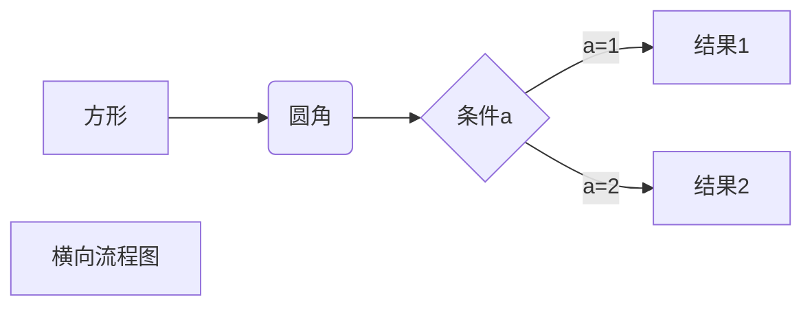
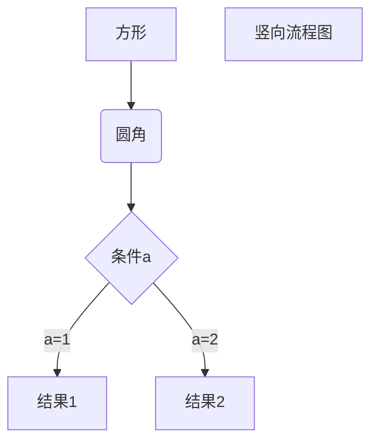
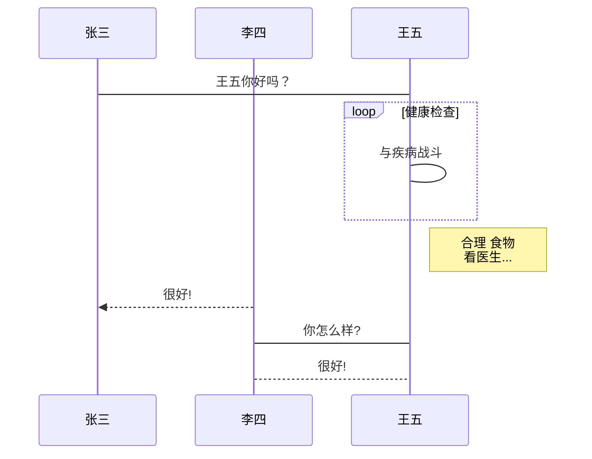

---

layout: post
title: md
subtitle: 'md'
date: 2021-11-13
categories: test
tags:  md

---

# md #
---
## md格式 ##
### 1. 标题 ###

使用 **=** 和 **-** 标记一级和二级标题

我展示的是一级标题
=================

我展示的是二级标题
-----------------
使用 # 来进行层级标识。共 6 个层级，再多不识别。

# 一级标题
## 二级标题
### 三级标题
#### 四级标题
##### 五级标题
###### 六级标题

　　注：h1 级别会默认带一个 <hr/>

### 2. 段落

#### 换行
段落的换行是使用两个以上空格加上回车

&使用空行来换行
#### 字体
*斜体文本*
_斜体文本_
**粗体文本**
__粗体文本__
***粗斜体文本***
___粗斜体文本___

#### 分隔线 ####
　　至少三个 * 或 - 或 _ ，有空格也可以，不必连续。
可以在一行中用三个以上的星号、减号、底线来建立一个分隔线，行内不能有其他东西。你也可以在星号或是减号中间插入空格。
#### 删除线
~~这样~~
#### 下划线
<u>带下划线文本</u>

#### 脚注 ####
类似[^这样]
[^这样]: 那样

### 3. 列表 ###
#### 有序列表
（注意，' . ' 后面要跟一个空格）：

1
2
3
1. xxxx
2. xxxxx
3. xxxx
#### 无序列表
（注意，' * ' 后面要跟一个空格，星号(*)、加号(+)或是减号(-)都行）：

1
2
3
* xxxx
* xxxx
* xxxxx
　　也支持嵌套，使用时在嵌套列表前按 tab 或 空格 来缩进,去控制列表的层数。
#### 列表嵌套
只需在子列表中的选项前面添加四个空格即可
1. 第一项：
    - 第一项嵌套的第一个元素
    - 第一项嵌套的第二个元素
2. 第二项：
    - 第二项嵌套的第一个元素
    - 第二项嵌套的第二个元素
### 4. 区块 ###

> 这样
> 那样

区块是可以嵌套的，一个 > 符号是最外层，两个 > 符号是第一层嵌套，以此类推

> 这样
>> 那样

区块中使用列表
区块中使用列表实例如下：

> 区块中使用列表
> 1. 第一项
> 2. 第二项
> + 第一项
> + 第二项
> + 第三项

列表中使用区块
如果要在列表项目内放进区块，那么就需要在 > 前添加四个空格的缩进。

列表中使用区块实例如下：

* 第一项
    > 这样
    > 那样
* 第二项
* 
### 5. 代码 ###
如果是段落上的一个函数或片段的代码可以用反引号把它包起来（`），例如：

`printf()` 函数

#### 代码区块

代码区块使用 4 个空格或者一个制表符（Tab 键）。


        javascript
    $(document).ready(function ()  {
     alert('这样');
     });


　　或者
```
code code code
    code code code
    code
```
　　即首尾各多行  ``` 。

 ### 6. 链接 ###
　　格式：[页面文字](链接地址)，如：[ling](https://lingyaoe.github.io/)；
#### 高级链接
可以通过变量来设置一个链接，变量赋值在文档末尾进行


　　但是，md 中链接不支持 _blank，所以个人的写法还是直接写成： <a href="lingyaoe.github.io" target="_blank">lingxx</a> ；

 


 ### 7. 图片 ###
　　Markdown 图片语法格式如下：


开头一个感叹号 !
接着一个方括号，里面放上图片的替代文字
接着一个普通括号，里面放上图片的网址，最后还可以用引号包住并加上选择性的 'title' 属性的文字。
使用实例：
 

　　
 
也可以像网址那样对图片网址使用变量

Markdown 还没有办法指定图片的高度与宽度，如果你需要的话，你可以使用普通的  标签
### 8. 表格 ###
Markdown 制作表格使用 | 来分隔不同的单元格，使用 - 来分隔表头和其他行。

语法格式如下：

|  表头   | 表头  |
|  ----  | ----  |
| 单元格  | 单元格 |
| 单元格  | 单元格 |

对齐方式

我们可以设置表格的对齐方式：

-: 设置内容和标题栏居右对齐。
:- 设置内容和标题栏居左对齐。
:-: 设置内容和标题栏居中对齐。
实例如下：

| 左对齐 | 右对齐 | 居中对齐 |
| :-----| ----: | :----: |
| 单元格 | 单元格 | 单元格 |
| 单元格 | 单元格 | 单元格 |

### 9. 其他 ###
#### 支持的 HTML 元素
　　不在 Markdown 涵盖范围之内的标签，都可以直接在文档里面用 HTML 撰写。

目前支持的 HTML 元素有：
\<kbd> \<b> \<i> \<em> \<sup> \<sub> \<br>等 ，如：

使用 <kbd>Ctrl</kbd>+<kbd>Alt</kbd>+<kbd>Del</kbd> 重启电脑


#### 转义
Markdown 使用了很多特殊符号来表示特定的意义，如果需要显示特定的符号则需要使用转义字符，Markdown 使用反斜杠转义特殊字符：

**文本加粗** 
\*\* 正常显示星号 \*\*
Markdown 支持以下这些符号前面加上反斜杠来帮助插入普通的符号：

\\   反斜线
\`   反引号
\*   星号
\_   下划线
\{\}  花括号
\[\]  方括号
\(\)  小括号
\#   井字号
\+   加号
\-   减号
\.   英文句点
\!   感叹号


#### 公式
当你需要在编辑器中插入数学公式时，可以使用两个美元符 $$ 包裹 TeX 或 LaTeX 格式的数学公式来实现。提交后，问答和文章页会根据需要加载 Mathjax 对数学公式进行渲染。如：

$$
\mathbf{V}_1 \times \mathbf{V}_2 =  \begin{vmatrix} 
\mathbf{i} & \mathbf{j} & \mathbf{k} \\
\frac{\partial X}{\partial u} &  \frac{\partial Y}{\partial u} & 0 \\
\frac{\partial X}{\partial v} &  \frac{\partial Y}{\partial v} & 0 \\
\end{vmatrix}
${$tep1}{\style{visibility:hidden}{(x+1)(x+1)}}
$$

显示不出来

####流程图、时序图(顺序图)、甘特图

1、横向流程图源码格式：


2、竖向流程图源码格式：


3、标准流程图源码格式：

```flow
st=>start: 开始框
op=>operation: 处理框
cond=>condition: 判断框(是或否?)
sub1=>subroutine: 子流程
io=>inputoutput: 输入输出框
e=>end: 结束框
st->op->cond
cond(yes)->io->e
cond(no)->sub1(right)->op
```
4、标准流程图源码格式（横向）：

```flow
st=>start: 开始框
op=>operation: 处理框
cond=>condition: 判断框(是或否?)
sub1=>subroutine: 子流程
io=>inputoutput: 输入输出框
e=>end: 结束框
st(right)->op(right)->cond
cond(yes)->io(bottom)->e
cond(no)->sub1(right)->op
```
5、UML时序图源码样例：

```sequence
对象A->对象B: 对象B你好吗?（请求）
Note right of 对象B: 对象B的描述
Note left of 对象A: 对象A的描述(提示)
对象B-->对象A: 我很好(响应)
对象A->对象B: 你真的好吗？
```
6、UML时序图源码复杂样例：

```sequence
Title: 标题：复杂使用
对象A->对象B: 对象B你好吗?（请求）
Note right of 对象B: 对象B的描述
Note left of 对象A: 对象A的描述(提示)
对象B-->对象A: 我很好(响应)
对象B->小三: 你好吗
小三-->>对象A: 对象B找我了
对象A->对象B: 你真的好吗？
Note over 小三,对象B: 我们是朋友
participant C
Note right of C: 没人陪我玩
```
7、UML标准时序图样例：


8、甘特图样例：

```
gantt
 dateFormat  YYYY-MM-DD
 title     软件开发任务进度安排 
 excludes   weekends
​
 section 软硬件选型 
 硬件选择      :done,desc1, 2020-01-01,6w 
 软件设计      :active,desc2, after desc1,3w

 section 编码准备
 软件选择       :crit,done,desc3,2020-01-01,2020-01-29
 编码和测试软件   :1w
 安装测试系统    :2020-02-12,1w

 section 完成论文
 编写手册      :desc5,2020-01-01,10w
 论文修改      :crit,after desc3,3w
 论文定稿      :after desc5,3w
 ```
 emm 显示不出来